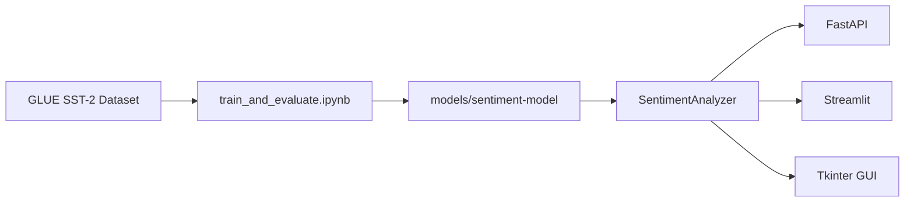

# Sentiment Analysis Toolkit


End-to-end NLP project for sentiment classification: fine-tune a transformer, serve predictions through a REST API, and explore results in a web or desktop UI.

## Highlights

- **Unified ML pipeline** — training notebook saves to `models/sentiment-model/`; apps load it automatically
- **REST API** — FastAPI with single-text, batch, and CSV upload endpoints
- **Web UI** — Streamlit dashboard with confidence scores, charts, and CSV export
- **Desktop GUI** — Tkinter app for offline use
- **Tests + CI** — pytest suite with GitHub Actions
- **Docker** — one-command API deployment

## Architecture



## Quick start

### 1. Install

```bash
git clone https://github.com/mhmodfrmwi/sentiment-analysis-toolkit.git
cd sentiment-analysis-toolkit
python -m venv .venv
source .venv/bin/activate  # Windows: .venv\Scripts\activate
pip install -r requirements.txt
pip install -e .
```

On first run, the toolkit downloads `distilbert-base-uncased-finetuned-sst-2-english` from Hugging Face (~260 MB).

### 2. Run

```bash
# Streamlit web UI (recommended for demos)
python main.py web

# REST API + interactive docs at http://localhost:8000/docs
python main.py api

# Desktop GUI
python main.py gui
```

### 3. Train your own model (optional)

Open `notebooks/train_and_evaluate.ipynb` in Google Colab or locally with a GPU. It fine-tunes DistilBERT on SST-2 and saves:

- `models/sentiment-model/` — model weights used by all apps
- `models/metrics.json` — accuracy and F1 from evaluation

## API examples

**Health check**

```bash
curl http://localhost:8000/health
```

**Analyze text**

```bash
curl -X POST http://localhost:8000/analyze \
  -H "Content-Type: application/json" \
  -d "{\"text\": \"I love this product!\"}"
```

**Response**

```json
{
  "text": "I love this product!",
  "label": "POSITIVE",
  "confidence": 0.9998,
  "scores": {
    "NEGATIVE": 0.0002,
    "POSITIVE": 0.9998
  }
}
```

**Batch analyze**

```bash
curl -X POST http://localhost:8000/analyze/batch \
  -H "Content-Type: application/json" \
  -d "{\"texts\": [\"Great service\", \"Terrible experience\"]}"
```

**CSV upload**

```bash
curl -X POST "http://localhost:8000/analyze/file?text_column=text" \
  -F "file=@reviews.csv"
```

## Project structure

```
sentiment-analysis-toolkit/
├── api/                    # FastAPI application
├── app/                    # Streamlit + Tkinter UIs
├── notebooks/              # Model training notebook
├── src/sentiment_toolkit/  # Core inference + preprocessing
├── tests/                  # pytest suite
├── models/                 # Local model + metrics (gitignored)
├── Dockerfile
├── docker-compose.yml
└── .github/workflows/ci.yml
```

## Model evaluation

| Model | Dataset | Accuracy | F1 (weighted) |
|-------|---------|----------|---------------|
| DistilBERT SST-2 (baseline) | GLUE SST-2 | ~0.91 | ~0.91 |
| Fine-tuned DistilBERT (yours) | GLUE SST-2 subset | Run notebook | Run notebook |

After training, copy `models/metrics.json` values into your CV/README.

## Docker

```bash
docker compose up api
# API available at http://localhost:8000
```

## Development

```bash
pip install -e ".[dev]"
pytest
```

## CV talking points

- Built an end-to-end NLP pipeline from dataset fine-tuning to production-style API
- Exposed transformer inference via REST with batch and file-upload workflows
- Added automated tests and CI to keep inference and API contracts reliable
- Containerized the API for repeatable deployment

## License

MIT — see [LICENSE](LICENSE).
